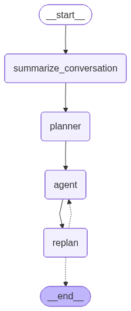

# PlannerAgent

> Flexible LangGraph Plan-and-Execute Agent with customizable knowledge bases, prompts, and tools

[](https://www.python.org/downloads/)
[](https://opensource.org/licenses/MIT)
[](https://langchain-ai.github.io/langgraph/)

## Overview

PlannerAgent is a Python package that implements a sophisticated **Plan-and-Execute** agent architecture using LangGraph. The agent breaks down complex queries into actionable steps, executes them iteratively, and replans dynamically based on results.

### How It Works

```
User Query → Summarize → Plan → Execute → Replan → Answer
                                   ↑         ↓
                                   ┴─────────┘
                              (Iterate until complete)
```

The agent:
1. **Summarizes** conversation context
2. **Plans** multi-step execution strategy
3. **Executes** each step with appropriate tools
4. **Replans** based on execution results
5. **Iterates** until objective is achieved
6. **Returns** final answer

## Features

**Async Architecture**
- Fully asynchronous implementation
- Non-blocking I/O for efficient execution
- Seamless integration with async frameworks like FastAPI
 
**Multi-Model Support**
- Mix and match OpenAI and Anthropic models
- Separate models for planning, replanning, and execution
- Cost optimization through strategic model selection

**Flexible Tool Integration**
- Built-in search tools (Tavily)
- Database query tools with MongoDB
- Easy custom tool integration
- Type-safe tool validation

**Knowledge Base**
- JSON-based knowledge base support
- Automatic knowledge injection into prompts
- Customizable knowledge format

**Persistent State**
- MongoDB checkpointing for state persistence
- Resume conversations across sessions
- Full conversation history tracking

**Streaming Support**
- Real-time execution updates
- Progress monitoring
- Event-driven architecture

## Installation

### From PyPI

```bash
pip install PlannerAgent
```

### From Source

```bash
git clone https://github.com/mmirz94/PlannerAgent.git
cd PlannerAgent
pip install -e .
```

### Dependencies

**Required:**
- Python ≥ 3.11
- LangGraph
- LangChain (OpenAI, Anthropic, Community)
- Pydantic
- MongoDB drivers (Motor, PyMongo)

**Optional:**
- pytest (for testing)
- black, ruff (for development)

## Quick Start

### Basic Usage

```python
import asyncio
from PlannerAgent.agent import PlanAndExecuteAgent

# Create agent with minimal configuration
agent = PlanAndExecuteAgent(
    kb_path="path/to/knowledge_base.json",
    planner_model="gpt-4o",
    planner_provider="openai",
    replanner_model="gpt-4o",
    replanner_provider="openai",
    agent_model="gpt-4o",
    agent_provider="openai",
)

# Run the agent
result = asyncio.run(
    agent.run(
        user_input="What are the latest AI developments?",
        user_id="user123"
    )
)

print(result.response)
```

### With Custom Tools

```python
import asyncio
from langchain_core.tools import tool
from langchain_tavily import TavilySearch
from PlannerAgent.agent import PlanAndExecuteAgent

# Define custom tool
@tool
def calculate(expression: str) -> float:
    """Evaluate a mathematical expression."""
    return eval(expression)

# Create search tool
search_tool = TavilySearch(max_results=3)

# Initialize agent with tools
agent = PlanAndExecuteAgent(
    kb_path="knowledge_base.json",
    planner_model="gpt-4o",
    planner_provider="openai",
    replanner_model="gpt-4o",
    replanner_provider="openai",
    agent_model="gpt-4o",
    agent_provider="openai",
    tools=[search_tool, calculate]
)

# Run with custom tools
result = asyncio.run(
    agent.run(
        user_input="Calculate 25 * 4 and search for the answer's significance",
        user_id="user123"
    )
)
print(result.response)
```

### Multi-Model Configuration

```python
import asyncio
from PlannerAgent.agent import PlanAndExecuteAgent

# Use powerful Claude for planning, fast GPT for execution
agent = PlanAndExecuteAgent(
    kb_path="knowledge_base.json",
    planner_model="claude-sonnet-4-5-20250929",
    planner_provider="anthropic",
    replanner_model="claude-sonnet-4-5-20250929",
    replanner_provider="anthropic",
    agent_model="gpt-4o-mini",  # Faster, cheaper for execution
    agent_provider="openai",
)

# Run with multi-model setup
result = asyncio.run(
    agent.run(
        user_input="Analyze the latest market trends",
        user_id="user123"
    )
)
print(result.response)
```

### With MongoDB Persistence

```python
import asyncio
from PlannerAgent.agent import PlanAndExecuteAgent

agent = PlanAndExecuteAgent(
    mongo_db_connection_string="mongodb://localhost:27017",
    db_name="planneragent",
    kb_path="knowledge_base.json",
    planner_model="gpt-4o",
    planner_provider="openai",
    replanner_model="gpt-4o",
    replanner_provider="openai",
    agent_model="gpt-4o",
    agent_provider="openai",
)

# Resume conversation
config = {"configurable": {"thread_id": "conversation_123"}}
result = asyncio.run(
    agent.run(
        user_input="Continue from where we left off",
        user_id="user123",
        config=config
    )
)
```

### Streaming Execution

```python
import asyncio
from PlannerAgent.agent import PlanAndExecuteAgent

# Create agent
agent = PlanAndExecuteAgent(
    kb_path="knowledge_base.json",
    planner_model="gpt-4o",
    planner_provider="openai",
    replanner_model="gpt-4o",
    replanner_provider="openai",
    agent_model="gpt-4o",
    agent_provider="openai",
)

# Stream execution updates
async def stream_agent():
    async for event in agent.stream(
        user_input="Plan a research project",
        user_id="user123",
        stream_mode="updates"
    ):
        print(f"Step: {list(event.keys())}")
        # Output: Step: ['summarize_conversation']
        #         Step: ['planner']
        #         Step: ['agent']
        #         Step: ['replan']

asyncio.run(stream_agent())
```

### Verbose Logging

Control logging output with the `verbose` parameter to monitor agent execution:

```python
# Level 0 (default): No logging - clean output
agent = PlanAndExecuteAgent(
    kb_path="knowledge_base.json",
    planner_model="gpt-4o",
    planner_provider="openai",
    replanner_model="gpt-4o",
    replanner_provider="openai",
    agent_model="gpt-4o",
    agent_provider="openai",
    verbose=0  # Silent mode
)

# Level 1: Show state at each step
agent = PlanAndExecuteAgent(
    ...,
    verbose=1  # Show states only
)
# Output:
# --------------------------------------------------------------------------------
# PLANNING STEP - State:
# <state details>
# --------------------------------------------------------------------------------

# Level 2: Show state + token usage for debugging
agent = PlanAndExecuteAgent(
    ...,
    verbose=2  # Show states and token usage
)
# Output:
# --------------------------------------------------------------------------------
# PLANNING STEP - State:
# <state details>
# --------------------------------------------------------------------------------
# ********************************************************************************
# PLANNER - Token Usage:
# <token usage details>
# ********************************************************************************
```

**Logging Levels:**
- `verbose=0`: No logging (production mode)
- `verbose=1`: State logging only (monitor workflow)
- `verbose=2`: State + token usage (debugging/cost tracking)

## API Documentation

### `PlanAndExecuteAgent`

Main agent class implementing plan-and-execute architecture.

#### Parameters

- **`mongo_db_connection_string`** (`Optional[str]`): MongoDB connection string for state persistence. Default: `None`.

- **`db_name`** (`Optional[str]`): Database name for MongoDB storage. Default: `None`.

- **`kb_path`** (`Optional[str]`): Path to knowledge base JSON file. Default: `None`.

- **`planner_model`** (`Optional[str]`): Model name for planning step (e.g., `"gpt-4o"`, `"claude-sonnet-4-5-20250929"`). 

- **`replanner_model`** (`Optional[str]`): Model name for replanning step.

- **`agent_model`** (`Optional[str]`): Model name for execution step. 

- **`planner_provider`** (`Literal["openai", "anthropic"]`): LLM provider for planner. Default: `"openai"`.

- **`replanner_provider`** (`Literal["openai", "anthropic"]`): LLM provider for replanner. Default: `"openai"`.

- **`agent_provider`** (`Literal["openai", "anthropic"]`): LLM provider for agent. Default: `"openai"`.

- **`tools`** (`Optional[List[BaseTool]]`): List of LangChain tools for the agent. Default: `None`.

- **`verbose`** (`int`): Logging verbosity level. Default: `0`.
  - `0`: No logging (production mode)
  - `1`: State logging at each step
  - `2`: State + token usage logging

#### Methods

##### `async run(user_input: str, user_id: str, config: Optional[dict] = None) -> OutputState`

Execute the agent and return final result.

**Parameters:**
- `user_input` (`str`): User's query or prompt
- `user_id` (`str`): Unique user identifier for performing user-based queries with `query` tool.
- `config` (`Optional[dict]`): Optional configuration (e.g., recursion limit, thread ID)

**Returns:**
- `OutputState`: Final response with status message and answer

**Example:**
```python
import asyncio

result = asyncio.run(
    agent.run(
        user_input="Analyze Q4 sales data",
        user_id="user123",
        config={"recursion_limit": 50}
    )
)
print(result.response)
```

##### `async stream(user_input: str, user_id: str, config: Optional[dict] = None, stream_mode: Literal["values", "updates"] = "updates")`

Stream agent execution with real-time updates.

**Parameters:**
- `user_input` (`str`): User's query or prompt
- `user_id` (`str`): Unique user identifier
- `config` (`Optional[dict]`): Optional configuration
- `stream_mode` (`Literal["values", "updates"]`): Stream mode - `"values"` for full state, `"updates"` for deltas

**Yields:**
- `dict`: State updates during execution of each node.

**Example:**
```python
import asyncio

async def stream_agent():
    async for event in agent.stream(
        user_input="Research topic",
        user_id="user123",
        stream_mode="updates"
    ):
        if "planner" in event:
            print(f"Plan: {event['planner']}")
        elif "agent" in event:
            print(f"Executing: {event['agent']}")

asyncio.run(stream_agent())
```

##### `save_graph_diagram(save_path: str)`

Save the agent's graph structure as an image.

**Parameters:**
- `save_path` (`str`): Path to save diagram (must end with `.png` or `.jpg`)

**Raises:**
- `ValueError`: If path doesn't end with `.png` or `.jpg`

**Example:**
```python
agent.save_graph_diagram("diagrams/agent_flow.png")
```

## Configuration

### Environment Variables

```bash
# OpenAI (Azure)
AZURE_OPENAI_ENDPOINT=https://your-endpoint.openai.azure.com/
AZURE_OPENAI_API_KEY=your-key

# Anthropic
ANTHROPIC_API_KEY=your-key

# Search (optional)
TAVILY_API_KEY=your-key

# MongoDB (optional)
MONGODB_URI=mongodb://localhost:27017
```

### Knowledge Base Format

JSON file with structured knowledge of:
- Domain-specific data
- Database schema and rules
- General rules to follow
- Examples

```json
{
  "company_info": {
    "name": "Acme Corp",
    "industry": "Technology"
  },
  "policies": {
    "refund": "30-day money-back guarantee",
    "shipping": "Free shipping over $50"
  }
}
```

The agent automatically includes this knowledge in planning and execution.


## Architecture

### Agent Flow



The agent follows a cyclical plan-and-execute workflow:

1. **Summarize Conversation** - Condenses conversation history and current query
2. **Planner** - Creates a multi-step execution plan with appropriate tools
3. **Agent (Execute)** - Executes the current step using the specified tool
4. **Replan** - Evaluates progress and either:
   - Returns final answer if objective is complete
   - Continues to next execution step if more work is needed

> **Note:** To regenerate this diagram, run `python generate_graph_diagram.py`

### Components

- **Nodes**: Summarize, Plan, Execute, Replan
- **Edges**: Conditional routing based on completion status
- **State**: Pydantic models for type safety
- **Tools**: Extensible tool system with LangChain
- **Checkpointing**: MongoDB-backed state persistence

## Examples

### Example 1: Research Assistant

```python
import asyncio
from langchain_tavily import TavilySearch
from PlannerAgent.agent import PlanAndExecuteAgent

# Create search tool
search = TavilySearch(max_results=5, include_raw_content=True)

# Initialize agent
agent = PlanAndExecuteAgent(
    kb_path="research_knowledge.json",
    planner_model="claude-sonnet-4-5-20250929",
    planner_provider="anthropic",
    replanner_model="claude-sonnet-4-5-20250929",
    replanner_provider="anthropic",
    agent_model="gpt-4o",
    agent_provider="openai",
    tools=[search]
)

# Research query
result = asyncio.run(
    agent.run(
        user_input="What are the latest advancements in quantum computing?",
        user_id="researcher_1"
    )
)
print(result.response)
```

### Example 2: Data Analysis Agent

```python
import asyncio
from langchain_core.tools import tool
from PlannerAgent.agent import PlanAndExecuteAgent

@tool
def query_database(sql: str) -> str:
    """Execute SQL query and return results."""
    # Your database logic here
    return "Query results: ..."

@tool
def create_visualization(data: str, chart_type: str) -> str:
    """Create data visualization."""
    # Your visualization logic
    return "chart_url"

# Initialize agent with custom data tools
agent = PlanAndExecuteAgent(
    kb_path="data_schema.json",
    planner_model="gpt-4o",
    planner_provider="openai",
    replanner_model="gpt-4o",
    replanner_provider="openai",
    agent_model="gpt-4o-mini",
    agent_provider="openai",
    tools=[query_database, create_visualization]
)

# Run data analysis
result = asyncio.run(
    agent.run(
        user_input="Analyze sales trends and create a bar chart",
        user_id="analyst_1"
    )
)
print(result.response)
```

## License

This project is licensed under the MIT License - see the [LICENSE](LICENSE) file for details.

## Citation

If you use PlannerAgent in your research or project, please cite:

```bibtex
@software{planneragent2024,
  author = {Mirzaloo, Salar},
  title = {PlannerAgent: Flexible LangGraph Plan-and-Execute Agent},
  year = {2024},
  url = {https://github.com/mmirz94/PlannerAgent}
}
```

## Support

- **Email:** sal.mirzaloo@gmail.com
- **Issues:** [GitHub Issues](https://github.com/mmirz94/PlannerAgent/issues)

## Acknowledgments

Built with:
- [LangGraph](https://langchain-ai.github.io/langgraph/) - Agent orchestration
- [LangChain](https://www.langchain.com/) - LLM framework
- [OpenAI](https://openai.com/) - GPT models
- [Anthropic](https://www.anthropic.com/) - Claude models
